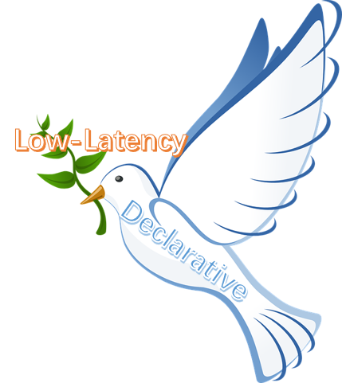
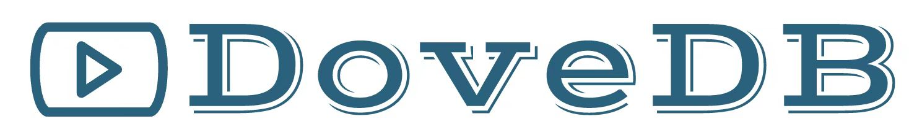
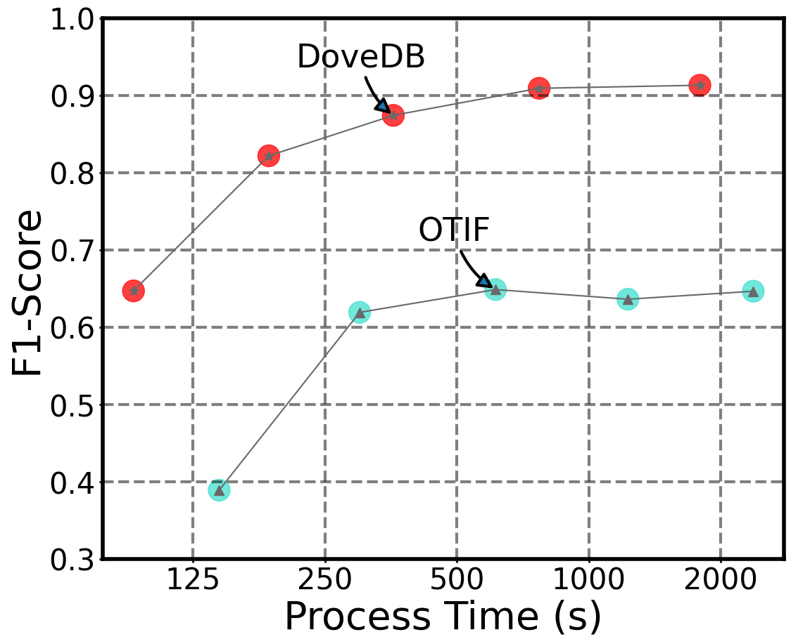
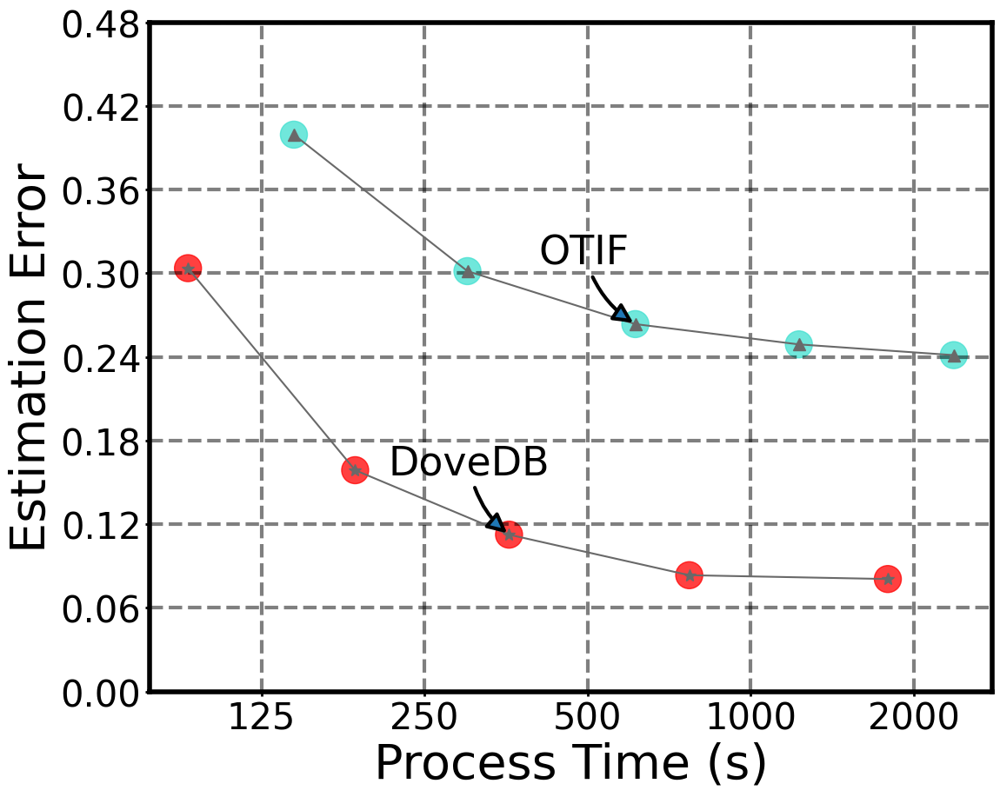
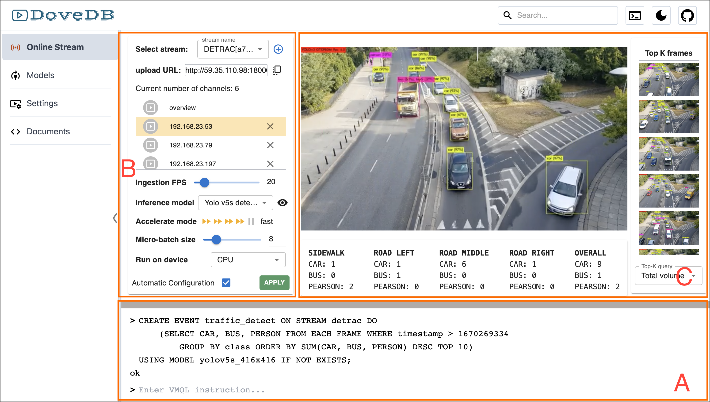

[![Slack chat][slack-img]](#get-in-touch)
[![Unit Tests][ci-img]](https://github.com/dovedb/DoveDB)

# DoveDB - a Declarative and Low-Latency Video Database

DoveDB, inspired by [OTIF](https://favyen.com/otif.pdf) and Multi-Object Tracking, is a systematic data management platform with high usability and low latency created by [DILAB](https://dilab-zju.github.io/). It is integrated with the following desirable features:

  * Declarative query language
  * Spark data model
  * Lightweight ingestion scheme
  * Versatile query scenarios
  * Efficient query processing

The system framework of DoveDB is illustrated in the [Figure]("./figs/framework.png"). Towards uniform management of data sources in the format of video files or live streams, we build an abstract data model called VideoSource, which is essentially inherited from Spark’s RDD. A real-time video ingestion engine is developed to extract semantic information, including textual labels, visual features and spatio-temporal metadata. The output is then used to construct offline indexes to facilitate online query processing. DoveDB provides SQL-like syntax to support convenient model training and query processing. Users can train a visual model on specified table columns, where we assume the annotations are available. The trained model can be conceived as a user-defined function and deployed on a target VideoSource for online inference. We also provide built-in model compression techniques such as neural network pruning and knowledge distillation to reduce model size and accelerate inference speed. Our query processing engine, assisted by the constructed offline indexes, can support a diversified category of queries, including traditional selection, aggregation and join queries (which are referred as one-shot queries), as well as continuous queries deployed on video streams. In the following, we present the core modules in DoveDB. Due to space limit, some of the implementation details are provided in our [technical report](https://github.com/dovedb/DoveDB/blob/main/technical%20report.pdf).

## Get Started & Involved

DoveDB is an open source project with open governance. We welcome contributions from the community, and we hope you can help improve and extend the project. Below I present a system overview of DoveDB.

### Data Model
----------
DoveDB is built upon Spark and supports queries against historical data and streaming data. We customize RDD to derive an abstract data model called **VideoSource** to uniformly manage data sources in the format of video files or live streams. The following SQL statements are examples of encapsulating a disk file or a network live stream as **VideoSource**.

	-- create VideoSource from an input file
	CREATE VideoSource traffic_a
		FROM FILE '/home/xzy/video-data/a.mp4';

	-- create VideoSource from a network live stream
	CREATE VideoSource traffic_b FROM CAMERA 'ip:port';

In other words, **VideoSource** is the basic data structure in DoveDB to support query processing. It is a collection of videos that can be processed in parallel. The elements of VideoSource are processed from the first frame to the subsequent frames along the time axis through RDD transformation. This procedure is typically accompanied by calculation or memory persistence, which enables model inference, indexing and storage on each frame.

### Query Language Syntax
----------
Several video database systems have extended SQL to VQL and provided declarative language for video data management and query processing. An example of selection query is illustrated in the following.

	SELECT frame FROM source_name
		WHERE CONTAINS(label, 'CAR')
			AND confidence > 0.8
		ORDER BY timestamp DESC;

In this paper, we devise a more expressive language called VMQL, which augments existing VQL with functionalities for model-oriented management and convenient deployment. For instances, to train an object detection model for an out-of-vacabulary object type, we can use the following statement

	CREATE YOLO model_name
		ON DATA_TABLE(img_column, label_column);

Here, we assume the training data have been annotated and stored in the database. The trained model is named and stored in our model corpus. It can be conceived as a user-defined function and applied on a VideoSource for visual inference:

	CREATE MONITOR_EVENT event_name
		USING model_name
		ON DATA_SOURCE source_name;

The above example shows how to create a monitoring event on a target VideoSource using our trained model.

### Real-time Ingestion
----------

Since visual inference cost via deep learning models is expensive, similar to [OTIF](https://favyen.com/otif.pdf), we adopt down-sampling to reduce the number of accessed frames. To extract tracklets of moving objects within a VideoSource, we treat the tracking process as a pipeline of object detection and association, and optimize each module separately. we compare DoveDB with OTIF in terms of the trade-off between
efficiency and query accuracy.

### Offline Index Construction
----------
For each distinct moving object, we generate a tracklet represented by a sequence of bounding boxes across the video frames. From the bounding boxes, we can extract visual features of the object and leverage high-dimensional index to support vision-based similarity search. The object detection model (i.e., [YOLOX](https://github.com/Megvii-BaseDetection/YOLOX) in our DoveDB) can also output the associated class labels, from which we build inverted index to preserve its associated video id and frame id. Furthermore, we can collect abundant spatio-temporal meta-data, including the location of cameras, the timestamps of video frames and the positions of the detected bounding boxes. These data, integrated with spatio-temporal indexes, can be used to support interesting location-aware queries or mining tasks.

### Visual Model Management
----------
In DoveDB, a visual model is conceived as a user-defined function to perform a specified inference task, such as object detection, image classification, image segmentation, etc. DoveDB is integrated with built-in functions to train a new model from scratch or fine-tune an existing visual model with additional annotation data. In order to support model training and inference, the system integrates [PyTorch](https://pytorch.org/) as the deep learning framework and exposes batch data feeding API to support other machine learning frameworks.

### Query Processing Engine
----------
With the textual, visual, and spatio-temporal indexes built from the extracted tracklets, online queries can be processed with very low latency. For instance, to retrieve video frames containing ambulance and firetruck, we can simply perform an intersection between the two inverted lists of these two labels. As another example, to estimate the traffic flow with a time period, we can leverage the spatial-temporal index to identify the relevant video frames and aggregate the number of distinct objects within these frames. If a query cannot be answered via the offline index and requires online inference, we also provide model compression techniques, including network pruning and knowledge distillation, to reduce model size and improve inference speed. Finally, our real-time ingestion scheme can be naturally used to support continuous object tracking queries.

## Modern Web UI

we show the user interface of DoveDB for declarative video query processing. The layout contains three main components, marked as zone A, B, and C, respectively

### A. Textbox for command lines

Zone A is a **textbox for command lines** where users can interact with our system directly using VMQL statements. As shown in the figure, the user defines a traffic flow estimation event and mount it on a specified video stream. The statement indicates YOLOv5s as the object detector and the goal is to continuously maintains top-10 densest frames.

### B. Parameter configuration panel

Zone B is a **parameter configuration panel**. In its top area, users can select an existing video stream via the drop-down box or create a new stream by clicking the button ⊕. The streams with active monitoring events are listed and users can select one of them for detailed configuration, such as setting the ingesting speed, micro-batch size and hardware device, or determining the model for online inference. At the bottom of Zone B, the checkbox “Automatic Configuration” indicates whether the users allow the system to automatically determine the best trade-off between efficiency and accuracy. This step could be computationally expensive.

### C. Display panel for VMQL query results

Zone C is a **display panel for VMQL query results**. There are three sub-areas designed to provide different perspectives of query results. The center of display portal is designed to visualize overall detection results of each frame. On the right of Zone C, the top-10 frames selected by a query would be listed. The bottom part contains aggregation results on different lanes.

The DoveDB system supports a variety of scenarios, including model training or fine-tuning, specific queries in specific scenarios, etc.

  * Model training and inference
  * Selection and aggregation queries
  * Continuous query on video streams
  * ... ...

## Related Repositories

### Documentation

  * Published in IEEE TKDE: [Towards One-Size-Fits-Many: Multi-Context Attention Network for Diversity of Entity Resolution Tasks](https://ieeexplore.ieee.org/abstract/document/9360523/)
  * Published in AAAI 2023: Human-in-the-Loop Vehicle ReID
  * Researching: [Sampling-Resilient Multi-Object Tracking](https://github.com/dovedb/DoveDB/blob/main/technical%20report.pdf)

### Deployment

  * It will be revealed later

### Components

 * [UI](https://github.com/dovedb/DoveDB)
 * [Data model](https://github.com/dovedb/DoveDB)

## Contributing

See [CONTRIBUTING](./CONTRIBUTING.md).

Thanks to all the people who already contributed!

### Maintainers

Below are the official maintainers of the DoveDB project.

* [@xiaoziyang](https://github.com/xzymustbexzy)
* [@lizepeng](https://github.com/lzzppp)

### Emeritus Maintainers

We are grateful to our former maintainers for their contributions to the DoveDB project.

  * It will be revealed later

## Get in Touch

Have questions, suggestions, bug reports? Reach the project community via these emails:

* xiaoziyang.xzy@gmail.com
* lizepeng@zju.edu.cn

## Adopters

DoveDB as a product consists of multiple components. We want to support different types of users, whether they are only using our instrumentation libraries or full end to end DoveDB installation, whether it runs in production or you use it to troubleshoot issues in development.

## License

Copyright (c) The Jaeger Authors. [Apache 2.0 License](./LICENSE).

[ci-img]: https://github.com/jaegertracing/jaeger/workflows/Unit%20Tests/badge.svg?branch=main
[slack-img]: https://img.shields.io/badge/slack-join%20chat%20%E2%86%92-brightgreen?logo=slack
