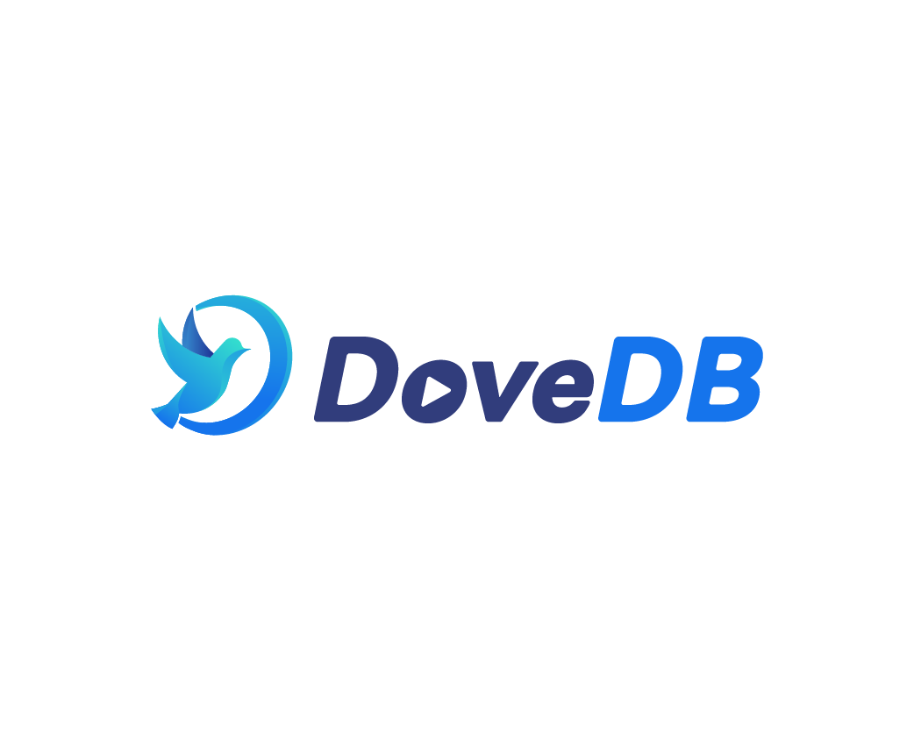
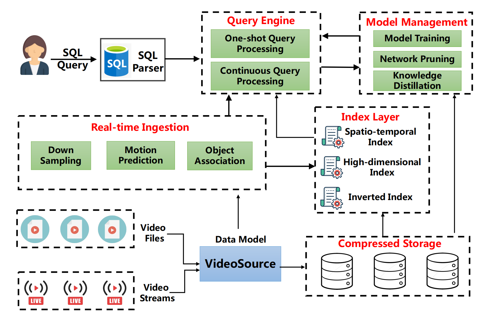

[![Slack chat][slack-img]](#get-in-touch)
[![Unit Tests][ci-img]](https://github.com/dovedb/DoveDB)



# DoveDB - a Declarative and Low-Latency Video Database



## Video Demo
Here is a video to introduce our DoveDB system. 

[](https://www.youtube.com/watch?v=O6_9zCi1zUA)

## Related Repositories

### Documentation

  * Published in IEEE TKDE: [Towards One-Size-Fits-Many: Multi-Context Attention Network for Diversity of Entity Resolution Tasks](https://ieeexplore.ieee.org/abstract/document/9360523/)
  * Published in AAAI 2023: Human-in-the-Loop Vehicle ReID
  * Researching: [Sampling-Resilient Multi-Object Tracking](https://github.com/dovedb/DoveDB/blob/main/technical%20report.pdf)

**Title**：Towards One-Size-Fits-Many: Multi-Context Attention Network for Diversity of Entity Resolution Tasks

**Journal**：*IEEE Transactions on Knowledge and Data Engineering（TKDE 2022）*

<!-- **Volume, issue, page number and date**：Volume: 34, Issue: 12, 01 December 2022

**DOI**：[10.1109/TKDE.2021.3060790]([https://doi.org/10.1109/CST.2023.101101](https://doi.org/10.1109/TKDE.2021.3060790)) -->

**Cite**: 
```
@article{DBLP:journals/tkde/ZhangLWTC22,
  author    = {Dongxiang Zhang and
               Zepeng Li and
               Xiaoli Wang and
               Kian{-}Lee Tan and
               Gang Chen},
  title     = {Towards One-Size-Fits-Many: Multi-Context Attention Network for Diversity
               of Entity Resolution Tasks},
  journal   = {{IEEE} Trans. Knowl. Data Eng.},
  volume    = {34},
  number    = {12},
  pages     = {6018--6032},
  year      = {2022},
  url       = {https://doi.org/10.1109/TKDE.2021.3060790},
  doi       = {10.1109/TKDE.2021.3060790},
  timestamp = {Mon, 05 Dec 2022 13:33:51 +0100},
  biburl    = {https://dblp.org/rec/journals/tkde/ZhangLWTC22.bib},
  bibsource = {dblp computer science bibliography, https://dblp.org}
}
```

**Title**：Human-in-the-Loop Vehicle ReID

**Journal**：*Association for the Advancement of Artificial Intelligence（AAAI 2023）*

**PDF**: [Human-in-the-Loop Vehicle ReID](https://github.com/dovedb/DoveDB/blob/main/Documentation/hitl_aaai.pdf)

**Cite**: Waiting for manuscript

### Maintainers

Below are the official maintainers of the DoveDB project.

* [@xiaoziyang](https://github.com/xzymustbexzy)
* [@lizepeng](https://github.com/lzzppp)

## Get in Touch

Have questions, suggestions, bug reports? Reach the project community via these emails:

* xiaoziyang.xzy@gmail.com
* lizepeng@zju.edu.cn

## Adopters

DoveDB as a product consists of multiple components. We want to support different types of users, whether they are only using our instrumentation libraries or full end to end DoveDB installation, whether it runs in production or you use it to troubleshoot issues in development.

## License

Copyright (c) The Jaeger Authors. [Apache 2.0 License](./LICENSE).

[ci-img]: https://github.com/jaegertracing/jaeger/workflows/Unit%20Tests/badge.svg?branch=main
[slack-img]: https://img.shields.io/badge/slack-join%20chat%20%E2%86%92-brightgreen?logo=slack
