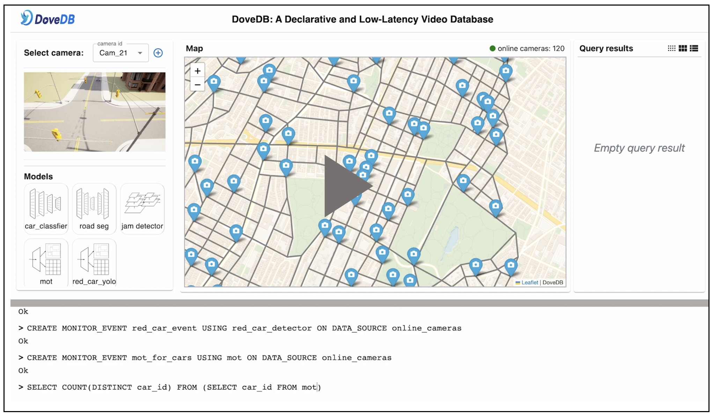

[![Slack chat][slack-img]](#get-in-touch)
[![Unit Tests][ci-img]](https://github.com/dovedb/DoveDB)


# DoveDB - a Declarative and Low-Latency Video Database

DoveDB 🕊️ is a database for intelligent video data management and analysis. Drawing inspiration from the world's most advanced vision AI methods, DoveDB represents a significant leap forward in open-source research and development in the field of video data handling.

<!--  -->

## Video Demo
Here is a video to introduce our DoveDB system. 

[](https://www.youtube.com/watch?v=N139dEyvAJk)

## Quick Start

To get started with DoveDB and experience its core features, you can use the MVP version of DoveDB available in [This repository](https://github.com/dovedb/DoveDB_MVP).

### Requirements

1. Clone the repository
```bash
git clone https://github.com/dovedb/DoveDB_MVP.git
```

2. Ensure either `OpenGauss` or `PostgreSQL` is installed.

You have two options for installing the database management system as the engine of index storage: `OpenGauss` or `PostgreSQL`. Choose the one that best suits your needs.

- Option1: `OpenGauss`

To install `OpenGauss`, please follow the installation instructions provided in the [official documentation](https://docs.opengauss.org/zh/docs/3.1.0/docs/installation/installation.html).

- Option2: `PostgreSQL`

Alternatively, you can install `PostgreSQL` by following the steps outlined in the official PostgreSQL documentation. You can find the [installation guide here](https://www.postgresql.org/download/).

3. Install the necessary dependencies provided in the requirements.txt.
```bash
cd src && pip install -r requirements.txt 
```

### Usage

1. Download the provided ETL (Extract, Transform, Load) data which will be used for demonstration purposes.

[Download ETL Data Here](https://drive.google.com/file/d/1KGcr2wEF9_9s_YRgSI30Uwk4QfPCCuyp/view?usp=sharing)

Once downloaded, move the file to the src/data directory.

2. Launch DoveDB Server
Navigate to the `src` directory and start the server:
```python
cd src
python run_server.py --load_etl_data data/parsed.json
```

3. Launch DoveDB Client
In another terminal instance, initiate the client:
```python
cd src
python client.py
```

4. Aggregation Query:

Count Cars in the First 120 Seconds:
```sql
SELECT COUNT(DISTINCT track_id) FROM cars WHERE timestamp < 120 AND confidence > 0.7;
```

Calculate Stay Duration of a Specific Car:
```sql
SELECT MAX(timestamp) - MIN(timestamp) as stay_duration FROM cars WHERE track_id = 20;
```

5. Selection Query:

Top Frames with Most Cars:
```sql
SELECT frameid, COUNT(track_id) as car_count FROM cars GROUP BY frameid ORDER BY car_count DESC LIMIT 5;
```

## Publications

1. *Co-movement Pattern Mining from Videos*. VLDB 2024 [[pdf]](https://browse.arxiv.org/pdf/2308.05370.pdf) [[cite]](https://dblp.org/rec/journals/corr/abs-2308-05370.html?view=bibtex) 

2. *DoveDB: A Declarative and Low-Latency Video Database*. VLDB 2023 demo. [[pdf]](https://www.vldb.org/pvldb/vol16/p3906-zhang.pdf) [[cite]](https://dl.acm.org/doi/10.14778/3611540.3611582)

3. *Human-in-the-Loop Vehicle ReID*. AAAI 2023. [[pdf]](https://github.com/dovedb/DoveDB/blob/main/Documentation/hitl_aaai.pdf) [[cite]](https://researchr.org/publication/LiZS023-0/bibtex)

4. *Towards One-Size-Fits-Many: Multi-Context Attention Network for Diversity of Entity Resolution Tasks*. TKDE 2022. [[pdf]](https://ieeexplore.ieee.org/abstract/document/9360523/) [[cite]](https://dblp.org/rec/journals/tkde/ZhangLWTC22.bib?param=1)


## Contribute
We greatly value your contributions and are committed to making your involvement with DoveDB as straightforward and transparent as possible. 


## License

**Apache-2.0 License**: Our open-source software is made available under the Apache-2.0 license, which is approved by the Open Source Initiative (OSI). This open-source license encourages collaboration and knowledge sharing and is particularly suitable for students and enthusiasts who want to contribute and utilize our software.

## Get in Touch

Have questions, suggestions, bug reports? Reach the project community via these emails:

* xiaoziyang.xzy@gmail.com
* lizepeng@zju.edu.cn

[ci-img]: https://github.com/jaegertracing/jaeger/workflows/Unit%20Tests/badge.svg?branch=main
[slack-img]: https://img.shields.io/badge/slack-join%20chat%20%E2%86%92-brightgreen?logo=slack
